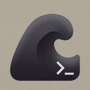

<div align="center">



# Tide

**A GPU-rendered terminal workspace for macOS**

[](https://github.com/eatnug/tide/releases)
[](LICENSE)


</div>

Everything you need stays in one window. Terminals, files, editor, browser — split them, stack them, zoom into one. Context stays with you however you work.

## Features

- **Split panes** — tile terminals side by side, drag to resize
- **File tree** — always in sync with what you're working on
- **Editor dock** — code, diffs, browser, markdown preview alongside your terminal
- **Stacked mode** — collapse into tabs for focused single-pane work
- **Session restore** — pick up exactly where you left off
- **GPU rendering** — powered by wgpu for smooth, low-latency output

## Keybindings

Customizable via `~/.config/tide/settings.json`.

| Key | Action |
|---|---|
| `Cmd+1` / `2` / `3` | Toggle file tree / pane area / editor dock |
| `Cmd+H/J/K/L` | Navigate within area |
| `Cmd+Enter` | Toggle fullscreen zoom |
| `Cmd+T` | New split (horizontal) |
| `Cmd+Shift+T` | New split (vertical) |
| `Cmd+W` | Close pane |
| `Cmd+I` / `Cmd+O` | Dock tab prev / next |
| `Cmd+Shift+O` | File finder |
| `Cmd+F` | Search |

## Install

Download the latest `.dmg` from [Releases](https://github.com/eatnug/tide/releases).

## Build from Source

```sh
cargo build --release                    # binary
cargo bundle --release -p tide-app       # macOS .app bundle
./scripts/build-dmg.sh                   # signed + notarized DMG
```

## Architecture

```
tide-app          Application entry, event loop, rendering
tide-platform     Native macOS platform layer (NSApplication/NSWindow/NSView)
tide-renderer     wgpu-based GPU renderer
tide-terminal     Terminal emulation (alacritty_terminal backend)
tide-editor       Built-in editor
tide-layout       Pane layout engine
tide-tree         File tree
tide-input        Keybinding & input handling
tide-core         Shared types and utilities
```

## License

[MIT](LICENSE)
