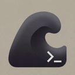

<div align="center">



# Tide

**A native macOS Workspace where humans and coding agents share Terminal, Editor, Diff, and Browser Panes.**

[](https://github.com/team-attention/tide/releases)
[](LICENSE)


</div>

Tide is an Integrated Task Environment for agent-led software work. Run Claude Code, Codex, or Gemini in Terminal Panes, split larger tasks into Workspaces, inspect code and diffs beside the task, and give Wrapped Agents a human-visible Browser Pane for previews, docs, and verification.

Through the Agent Gateway and Tide MCP Runtime, Wrapped Agents can inspect Workspace structure and Pane geometry, operate Browser Panes through Tide's Browser Pane Runtime, capture Terminal or Editor Pane content on request, and manage Context Artifacts. Browser Pane operations are the default path for Wrapped Agents using the Tide MCP Runtime; external browser runtimes remain explicit fallbacks.

https://github.com/user-attachments/assets/c4d04f84-e4fe-4aba-9202-044314f5f3ad

## Features

### Run Multiple Coding Agents

Launch Claude Code, Codex, or Gemini from Terminal Panes. Split agents side by side in the Stage, keep separate tasks in separate Workspaces, and when they are launched through Tide wrappers or auto-integration, see whether each Wrapped Agent is running, idle, or waiting for input.

### Keep Each Task in a Workspace

Each Workspace has its own Pane layout and focus state. Split the Stage, switch to stacked view when you need one focused surface, and move between Workspaces without losing task context.

### Use the Dock as a Terminal Context Surface

Keep the Terminal in the Stage and open its supporting Panes in the Dock: inspect code in an Editor Pane, check a running app in a Browser Pane, compare a Diff Pane, or keep a Render Pane (Browser Pane render mode) beside the command that produced it. The Dock follows the focused Stage Terminal through the Associated Terminal relationship, so supporting context stays attached to the task that produced it.

### Share a Browser Pane With the Agent

Open a Browser Pane for docs, local previews, and unauthenticated public pages. Agents use `tide_open_browser`, `tide_browser_observe`, and `tide_browser_action` to inspect and operate the existing Browser Pane, with Browser Automation Cursor state visible in the page. External browser runtimes stay explicit fallbacks.

### Capture Context Without Leaving Tide

Create Context Artifacts from Dock Pane selections and comments, then deliver them to the paired agent for the source Pane's Associated Terminal. Agents can explicitly list and read those artifacts through MCP instead of relying on hidden prompt context.

### Render Agent-Generated UI

Agents can create Render Panes (Browser Panes in render mode) with `tide_render_html` from HTML fragments for task dashboards, checklists, reports, or custom controls in the same Workspace.

## Install

### DMG

Download the latest `.dmg` from [Releases](https://github.com/team-attention/tide/releases), open it, and drag Tide to Applications.

### From source

```sh
cargo build --release                    # binary
./scripts/build-app.sh                   # macOS .app bundle + Info.plist fixup + ad-hoc sign
./scripts/build-dmg.sh                   # signed + notarized DMG
```

## How Tide Is Organized

```text
┌───────────┬─────────────────────┬──────────┬──────────┐
│ Workspace │        Stage        │   Dock   │ FileTree │
│ rail      │  Terminal Panes     │ Editor   │ View     │
│           │ splits + stacked    │ Browser  │          │
│           │                     │ Diff     │          │
└───────────┴─────────────────────┴──────────┴──────────┘
   Cmd+E        Cmd+H/J/K/L        Cmd+\       Cmd+B
```

- **Workspace rail**: switch between task Workspaces.
- **Stage**: the main area for Terminal Panes, splits, and stacked views.
- **Dock**: the focused Terminal's Terminal Context Surface for Editor, Browser, Diff, Launcher, secondary Terminal, and Render Panes (Browser Pane render mode).
- **FileTree View**: the outer-right filesystem view rooted at the focused Terminal's working directory.

## Quick Start

1. Open Tide. It starts with one Workspace and one Terminal Pane.
2. Run a coding agent inside the Terminal, such as Claude Code, Codex, or Gemini.
3. Add another Terminal with `Cmd+T`, split the current FocusArea top/bottom with `Cmd+Shift+T`, or open a Browser Pane with `Cmd+Shift+B`.
4. Open or focus the Dock with `Cmd+\`. If opening the Dock creates or focuses a Launcher, use the Launcher keys: `B` for a Browser Pane, `E` for a new Editor Pane, `O` to open a file, or `T` for a Terminal Pane.
5. The Dock is tied to the focused Terminal Pane in the Stage. When you move between Terminal Panes, the Dock swaps to that Terminal's Terminal Context Surface.
6. Use `Cmd+B` for FileTree View, `Cmd+E` for the Workspace rail, `Cmd+[` / `Cmd+]` to switch Workspaces, and `Cmd+Shift+N` for a new Workspace.

## Keyboard Shortcuts

These are the default macOS shortcuts. GlobalAction binding overrides are stored in the platform config directory: `~/Library/Application Support/tide/settings.json` on macOS and `~/.config/tide/settings.json` on Linux. Open settings with `Cmd+,`.

Some Browser and Editor Pane shortcuts below are handled inside the focused Pane rather than through the global keybinding table.

### Workspace

| Shortcut | Action |
| --- | --- |
| `Cmd+[` / `Cmd+]` | Previous / next Workspace |
| `Cmd+Shift+N` | New Workspace |
| `Cmd+Shift+W` | Close Workspace |
| `Cmd+E` | Toggle Workspace rail |

### Panes

| Shortcut | Action |
| --- | --- |
| `Cmd+T` | New Terminal as a right-side Stage split, or a Launcher when the Dock is focused |
| `Cmd+Shift+T` | Split the current FocusArea into top/bottom panes |
| `Cmd+\` | Open, focus, or close the Dock |
| `Cmd+W` | Close focused Pane |
| `Cmd+Enter` | Toggle stacked view for the current FocusArea |
| `Cmd+Ctrl+Enter` | Toggle Dock stacked view without changing the current FocusArea |
| `Cmd+Shift+B` | Open a Browser Pane for the current Terminal context |

### Launcher

| Key | Action |
| --- | --- |
| `B` | Browser Pane |
| `E` | New Editor Pane |
| `O` | Open file |
| `T` | Terminal Pane |

### Navigation

| Shortcut | Action |
| --- | --- |
| `Cmd+H/J/K/L` | Move focus left/down/up/right in the current FocusArea |
| `Cmd+Shift+H/J/K/L` | Navigate the Dock without changing the current FocusArea |
| `Cmd+B` | Toggle FileTree View |
| `Cmd+Shift+O` | Open FileFinder |

### Browser

| Shortcut | Action |
| --- | --- |
| `Cmd+L` | Focus and select the Browser URL bar in the focused Browser Pane |
| `Cmd+R` | Reload the focused Browser Pane |
| `Cmd+Shift+B` | Open a Browser Pane for the current Terminal context |

### Editor And Utilities

| Shortcut | Action |
| --- | --- |
| `Cmd+S` | Save focused Editor Pane, or open Save As for an untitled Editor Pane |
| `Cmd+F` | Find in the focused Terminal, Editor, or Browser Pane |
| `Cmd+C` / `Cmd+V` | Copy / paste |
| `Cmd+U` / `Cmd+D` | Scroll half page up / down |
| `Cmd++` or `Cmd+=` / `Cmd+-` / `Cmd+0` | Increase / decrease / reset font size |
| `Cmd+Ctrl+F` | Toggle fullscreen |
| `Cmd+N` | New Tide Window |
| `Cmd+,` | Open settings |

## Why Tide?

Tide is not trying to replace your terminal, editor, browser, or LLM. It is a shared task environment around them.

Terminals are still the substrate. The difference is that the surrounding Workspace is structured: Panes have identity, layout is inspectable, Browser Pane work is visible, context can be captured as Context Artifacts, and agents can use the same surfaces the human is using.

## Roadmap

Tide is moving from a terminal-centered agent app toward a full human-agent Workspace. The near-term product priorities are:

- **Editor Pane maturity**: stronger FileFinder, workspace text search, symbols, diagnostics, completion polish, hover hints, go-to-definition, and go-to-references.
- **Workspace rail hierarchy**: compact task rows with identity, branch/cwd, Wrapped Agent state, change signal, and useful last activity.
- **Browser review loop**: visible Browser Operation state, Browser Pane comments, and Context Artifact delivery to the paired agent.

See [Roadmap](docs/roadmap.md) for the full direction.

## Documentation

- [Vision](docs/vision.md)
- [Roadmap](docs/roadmap.md)
- [System docs](docs/README.md)
- [Domain glossary](docs/glossary.md)
- [Behavior tests guide](docs/testing/behavior-tests.md)

## License

[MIT](LICENSE)
