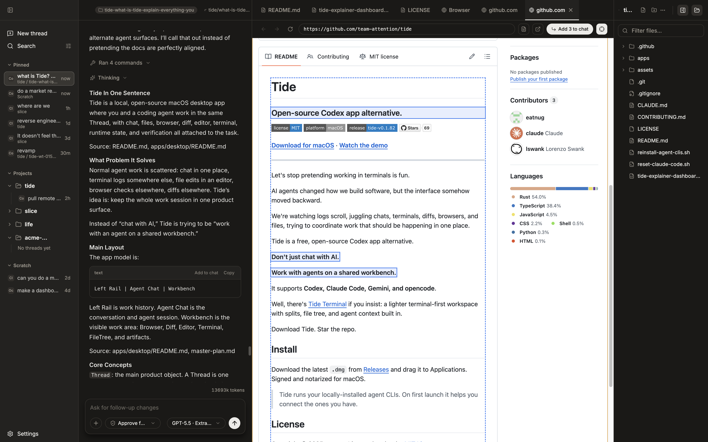
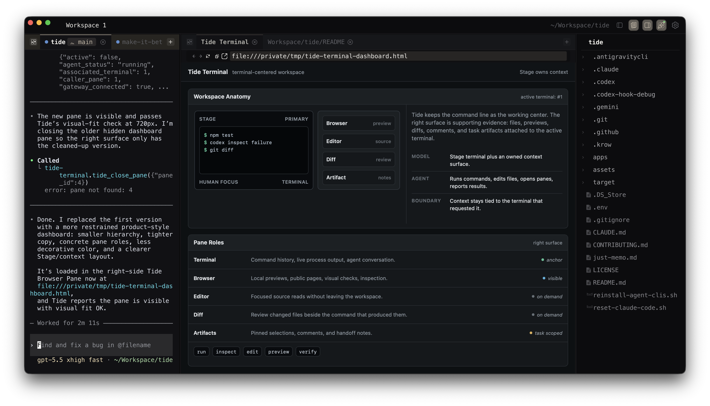

# Tide

### Open-source Codex app alternative for working with agents, not just chatting with them.

**[Download for macOS](https://github.com/team-attention/tide/releases/latest)** · **[Watch the demo](https://github.com/user-attachments/assets/c4d04f84-e4fe-4aba-9202-044314f5f3ad)**

---

Let's stop pretending working in terminals is fun.

AI agents changed how we build software, but the interface somehow moved
backward.

We're watching logs scroll, juggling chats, terminals, diffs, browsers, and
files, trying to coordinate work that should already be happening in one
place.

Tide is a free, open-source workbench for agent-led software work. It keeps
the conversation, commands, code, diffs, browser previews, and shared context
inside one task surface, so you and your agent can work from the same state.

**Don't just chat with AI.**

**Work with agents on a shared workbench.**

It supports **Codex, Claude Code, Gemini, and opencode** through the CLIs you
already run locally.

There are two ways to use the same idea:

- **[Tide](apps/desktop/)**: the chat-first Codex app alternative. Agent Chat
  stays central, and the Workbench opens when a Thread needs browser, diff,
  editor, terminal, file, or context-artifact surfaces.
- **[Tide Terminal](apps/terminal/)**: the terminal-first native macOS
  workspace. The Terminal stays the live source of truth, with shared panes and
  agent context around it.

Download Tide. Star the repo.

## Install

Download the latest `.dmg` from [Releases](https://github.com/team-attention/tide/releases/latest) and drag it to Applications. Signed and notarized for macOS.

> Tide runs your locally-installed agent CLIs. On first launch it helps you connect the ones you have.

## License

Copyright © 2025 eatnug. Licensed under the [MIT License](LICENSE).
