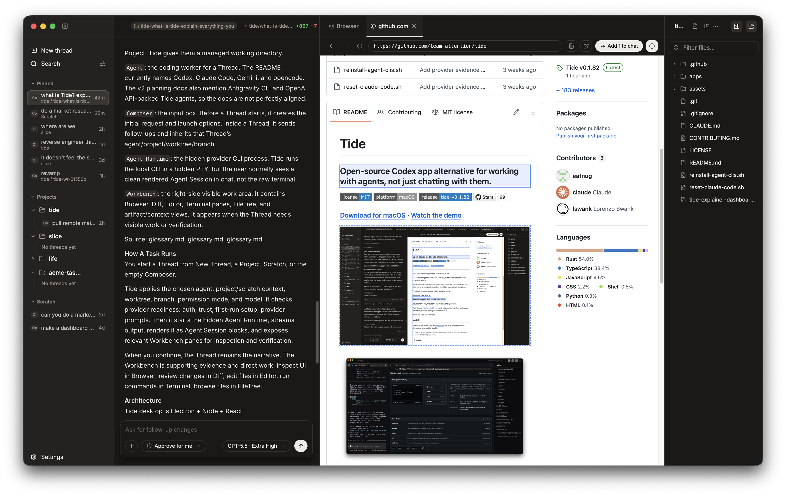

<div align="center">


# Tide

**Open-source Codex app alternative for working with agents, not just chatting with them.**

[](../../LICENSE)


</div>



Tide is the chat-first desktop app in this repo: a local, open-source
workbench for agent-led software work.

AI agents changed how we build software, but the interface moved backward.
Tide keeps the task in one place: the conversation, the agent session, the
commands, the files, the diff, the browser preview, and the explicit context
you share with the agent.

Each Thread has one focused Agent Chat with its Composer anchored to the chat.
When the task needs more than text, the Workbench opens beside it with Browser,
Diff, Editor, Terminal, FileTree, and Context Artifact views that you and the
agent can both inspect.

- **Claude Code, Codex, Gemini and opencode** are first-class agents.
- Any Thread can be powered by any supported agent.
- Local and account-free. Tide drives the CLIs already on your machine.
- The Agent Runtime stays out of the way until the Workbench needs to make the
  work visible.

The mental model is:

```text
Left UI | Agent Chat | Workbench
```

- **Left UI**: work history, grouped around your Threads and Projects.
- **Agent Chat**: one focused AI Agent chat for the selected Thread, with its Composer anchored at the bottom of the chat.
- **Workbench**: the optional visible work area inside the active Thread -
  Browser, Diff, Editor, Terminal, FileTree, and Context Artifact views for
  inspection, editing, verification, and direct work.

Don't just chat with AI. Work with agents on a shared workbench.

> Want the terminal to stay the live source of truth? See
> **[Tide Terminal](../terminal/)** (`apps/terminal/`).

## Install

Download the latest Tide `.dmg` from [Releases](https://github.com/team-attention/tide/releases/latest), then drag it to Applications.

> Building from source / contributing: see [`docs_v2/`](docs_v2/).

## Documentation

- [Master Plan](docs_v2/master-plan.md)
- [Glossary](docs_v2/glossary.md)
- [Specs](docs_v2/specs/README.md)
- [Architecture decisions](docs_v2/implementation/electron-node-architecture-decisions.md)

## License

[MIT](../../LICENSE).
